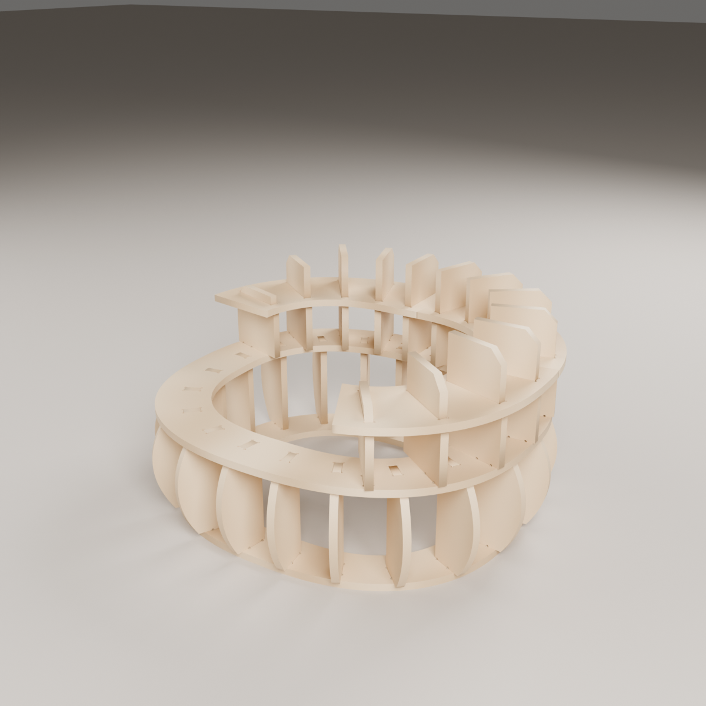
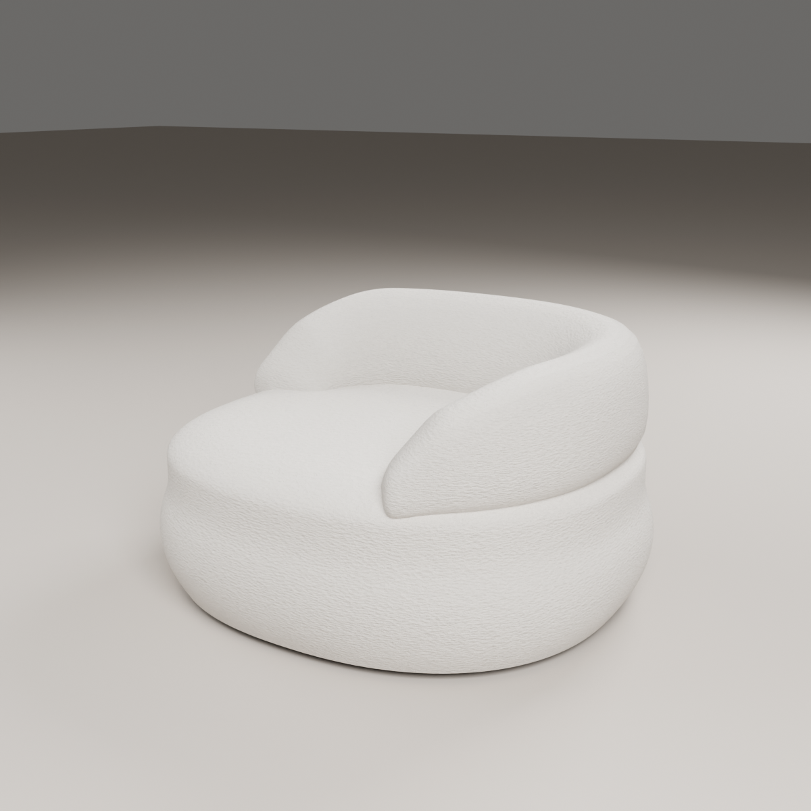

# Curl lounge chair — CNC cut file

Our own slot-and-tab MDF frame for a low boucle lounge chair whose back rolls
around the back and one side only (open on the other side). Reference
silhouette and finished size: the "Alba Chair" row in Airtable (W 100, D 90,
seat depth 70, H 63 cm with 4 cm legs). The frame, joints and nesting are
ours, built on the round tub armchair engine (`../round-armchair`).

| Frame | Upholstered (sales visual) |
|---|---|
|  |  |

## Size

Frame 979 × 884 × 530 mm (measured on the 3D assembly). Finished with foam
(seat 12~16 cm, back 5~7 cm, wrap 1~3 cm) and 4 cm legs: about 100 × 90 × 63 cm,
seat at about 43 cm.

## Structure (19 part types, 38 pieces, 18 mm MDF)

| # | Part | Qty | Role |
|---|---|---|---|
| 01 | BASE-RING | 1 | floor ring, 20 mortises |
| 02 | SEAT-RING | 1 | seat ring, 20 body-rib + 13 back-rib mortises |
| 03–07 | BODY-RIB-A…E | 4 each | radial ribs, bulging outer edge = the rounded seat block |
| 08–16 | BACK-RIB-A…I | 1–2 each | the roll: right-front (−54°) round the back to left-back (162°), easing down at both open ends |
| 17–19 | BACK-BAND-1…3 | 1 each | drop over the back rib tops onto a 10 mm shoulder, locking the spacing |

The back is asymmetric, so the back ribs need 9 profiles for 13 ribs.

## Boards

| File | Chairs | Boards 2440 × 1220 |
|---|---|---|
| `out/curl-chair.dxf` | 1 | 2 (board 2 holds 4 small ribs only) |
| `out/curl-chair_x2.dxf` | 2 | 3 |

## Checks (all pass)

```
python3 build.py && python3 build.py --sets 2
python3 verify.py        # 2D: tabs/mortises, relief, cutter reach, nesting, labels, DXF
python3 verify_3d.py     # 3D: 0 clashes, every rib bears on its carrier, overall size
python3 dxf_vs_3d.py     # every part in both DXFs = the verified 3D profile (0.000 mm2)
python3 package.py       # package/CURL_LOUNGE_CHAIR (67 checks)
```

## Renders

```
/root/.venvs/blender/bin/python render_blender.py frame|upholstered|exploded
/root/.venvs/blender/bin/python render_blender.py frame|upholstered|exploded|frame-back|top --sheet
/root/.venvs/blender/bin/python render_blender.py export     # OBJ + STL
python3 export_step.py && python3 sheets_png.py
```

## Status: CAD_COMPLETE_NOT_VALIDATED

Same open inputs as every frame: the real board thickness (caliper) and the
cutter diameter. Physical fit untested.
