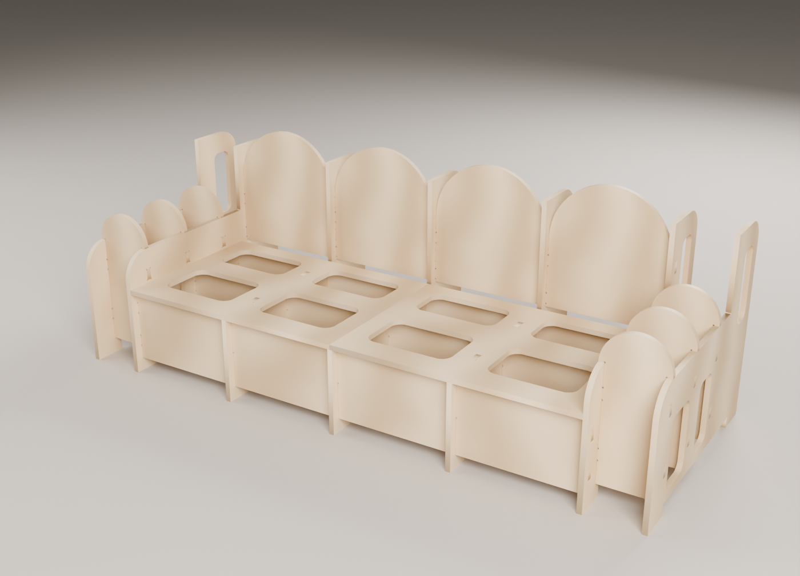
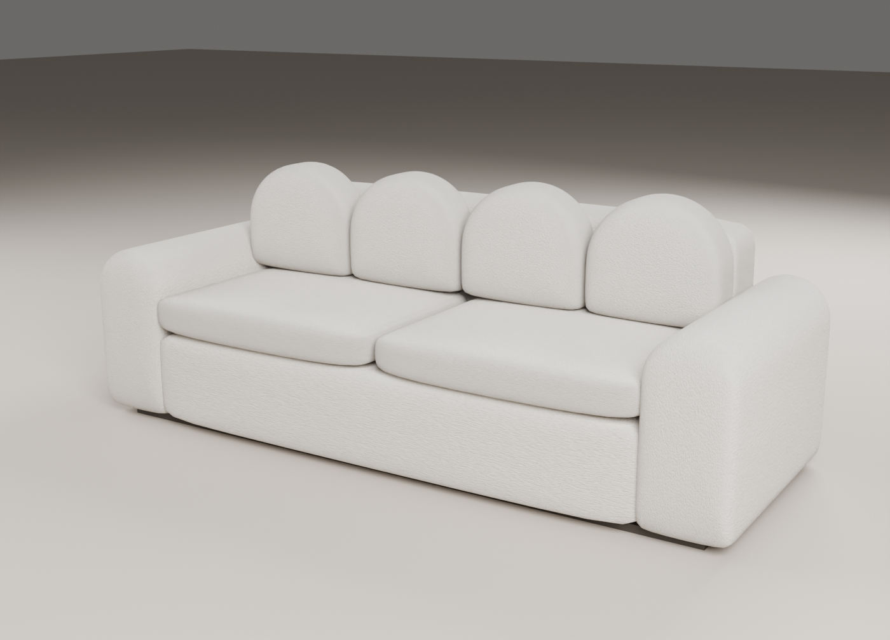

# Lena sofa — CNC cut file

Our own slot-and-tab MDF frame for the Lena silhouette: a straight 3-seat
sofa with four arched back cushions and round "drum" arms. Reference: the
"Lena Sofa" row in Airtable (Anas Ghalion, 8 sheets). The frame, joints and
nesting are ours: 22 pieces on 4 sheets.

| Frame | Upholstered (sales visual) |
|---|---|
|  |  |

## Size

Frame 2200 × 860 × 800 mm (measured on the 3D assembly). Seat deck at 330,
arm drums 570, back posts 720, arch crowns 800. Finished with foam about
226 × 90 × 85 cm, seat about 45 cm.

## Structure (11 part types, 22 pieces, 18 mm MDF)

Part numbers follow the assembly order.

| # | Part | Qty | Role |
|---|---|---|---|
| 01 | RIB-A | 2 | seat rib + back post, tabs up into the decks |
| 02 | RIB-B | 1 | middle rib + post, under the deck split |
| 03 | BACK-ARCH | 4 | the Lena arches, one per bay, tabbed into the posts either side |
| 04–06 | RAIL-FRONT / MID / BACK | 1 each | seat rails, cross-halved into the ribs, end tabs into the arms |
| 07–08 | ARM-INNER-L / R | 1 each | inner arm panels (rails, spacers, end arch) |
| 09 | ARM-SPACER | 6 | join the two panels of an arm; round cap = the drum top |
| 10 | ARM-OUTER | 2 | outer arm panels |
| 11 | SEAT-DECK | 2 | on the rib and rail tops; the second one is turned over |

Every piece lies in one of three planes, so the frame is an egg-crate. The
arches are staggered (left tabs at 360/500 mm, right tabs at 430/560 mm) so
two arches can tab into the same post. Ribs, arm panels and decks carry
rounded lightening / breathing holes (frame ≈ 71 kg of MDF).

## Assembly order (checked in 3D)

1. back chain: ribs and arches slid together along x
2. rails dropped into the rib halvings
3. inner arm panels slid onto the rail and end-arch tabs
4. spacers, then 5. outer arm panels
6. decks dropped onto the rib tabs

`verify_3d.py` moves every piece in from 500 mm away along its axis, in this
order, and fails if it touches anything already built.

## Checks (all pass)

```
python3 build.py
python3 verify.py        # 2D: topology, 19 x 41 mortises, relief, cutter reach, nesting, labels, DXF
python3 verify_3d.py     # 3D: 0 clashes, 54/54 mortises filled, load path, assembly sequence, size
python3 dxf_vs_3d.py     # every part in the DXF = the verified 3D profile (0.000 mm2)
python3 package.py       # package/LENA_SOFA
```

## Renders

```
/root/.venvs/blender/bin/python render_blender.py frame|upholstered|exploded
/root/.venvs/blender/bin/python render_blender.py step-back|step-rails|step-inner|step-spacers|step-outer|step-deck
/root/.venvs/blender/bin/python render_blender.py export     # OBJ + STL
python3 export_step.py && python3 sheets_png.py
```

## Status: CAD_COMPLETE_NOT_VALIDATED

Same open inputs as every frame: the real board thickness (caliper) and the
cutter diameter. Physical fit untested.
