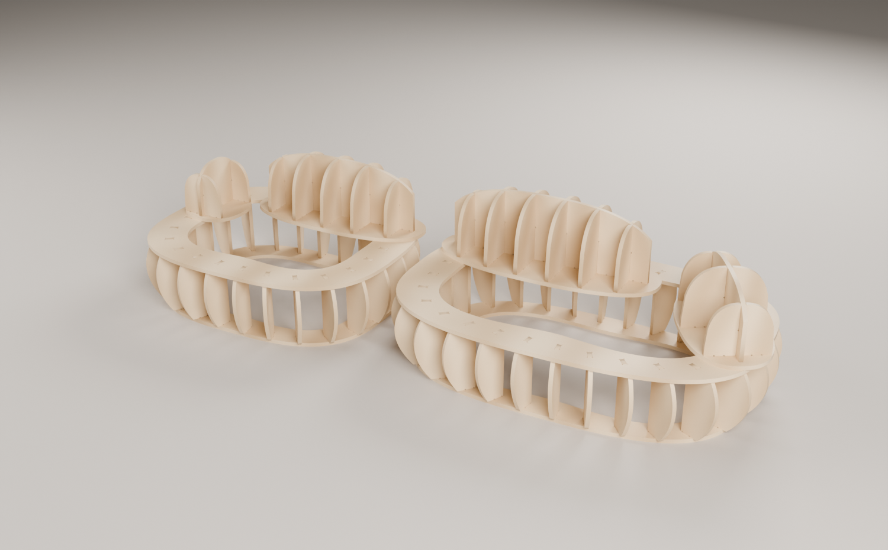
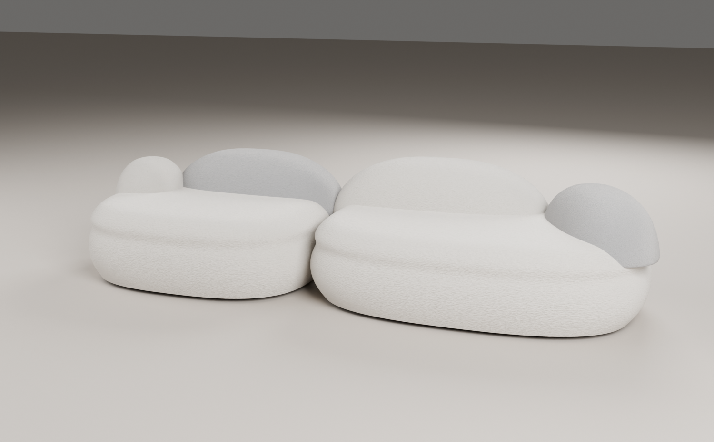

# Pebble sofa — CNC cut file

Our own slot-and-tab MDF frame for the "Pebble Rubble" sectional (reference:
Anas Ghalion post). Finished size from the reference drawing: 3100 wide
(left module 1350 + right 1750), depth 1110 / 1130. Two seat modules on the
tub-armchair engine plus four pebble cushions. 80 pieces on 4 sheets of 18 mm
MDF (the reference uses 6 sheets of 15 mm).

| Frame | Upholstered (sales visual) |
|---|---|
|  |  |

## Construction

| Group | Parts | Role |
|---|---|---|
| BASE | BASE-RING-L / R | floor rings |
| BODY | RIB-L* (24), RIB-R* (28) | radial ribs, bulging outer edge = the round seat sides; 4-fold symmetric, one profile per letter |
| SEAT | SEAT-RING-L / R | 190 mm band at seat height; elastic webbing across the opening |
| PLATE | PEBBLE-BL/EL/BR/AR-PLATE | oval plates, glued + screwed onto the seat rings |
| PRIB | PEBBLE-*-RIB* | transverse cushion sections, slot from the top |
| SPINE | PEBBLE-*-SPINE | lengthwise section, slots from the bottom, drops over the ribs |

Pebbles (finished footprint from the drawing; frame = minus ~30 mm foam):
back-left 1056 x 433, end-left 403 x 386, back-right 1215 x 495, arm-right
457 x 750 (turned -60 deg). Their plates sit 38-59 % on the seat-ring band and
overhang it by at most 42 mm; no two pebbles touch.

## Checks

```
./run_all.sh          # build, 2D + 3D checks, STEP, renders, package (log: out/run_all.log)
python3 verify.py     # topology, 19 x 41 mortises (in their own frame), relief, nesting, labels, DXF
python3 verify_3d.py  # 0 clashes, 152/152 mortises filled, load path, vertical assembly order
python3 dxf_vs_3d.py  # DXF = verified 3D
```

## Open inputs

Board thickness (caliper), cutter diameter, and the heights (seat 330 frame,
pebbles 250-320 above their plates) are our choices: confirm before cutting.
Physical fit untested.
