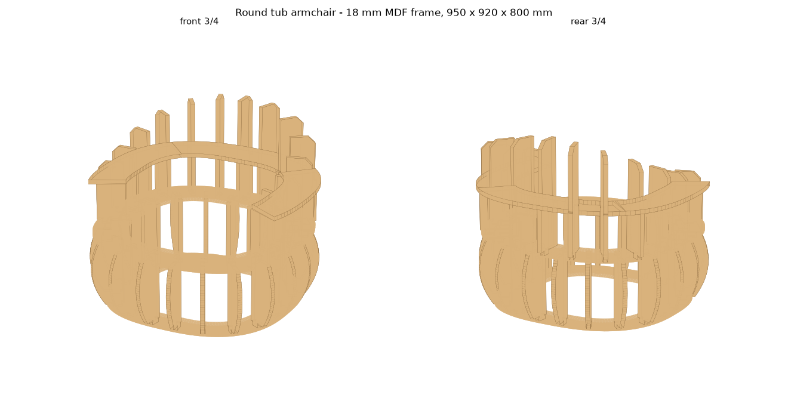

# Round tub armchair — CNC cut file

A round "tub" armchair frame (Edra-style silhouette, our own geometry) for
CNC routing from 18 mm MDF, assembled with slot-and-tab joints and glue.
Joint rules follow the bought Tokyo sofa pack: 19 × 41 mm mortises for 40 mm
tabs (1 mm clearance), 10 mm between parts, 9 mm clamping edge.



## Deliverables

| File | What it is |
|---|---|
| `out/round-armchair.dxf` | cut file — 2 sheets 2440 × 1220 × 18 mm, layers CUT / ENGRAVE-LABEL / REFERENCE-SHEET |
| `out/round-armchair-3d.png` | assembled frame, front and rear 3/4 |
| `out/round-armchair-sheets.png` | the two nested sheets |

## Size

950 × 920 mm in plan, back 800 mm, arms 600 mm, seat frame 330 mm
(≈430 mm with a 100 mm cushion). 38 pieces, 2.14 m² of board, ≈29 kg of MDF.

## Structure (17 part types, 38 pieces)

| # | Part | Qty | Role |
|---|---|---|---|
| 01 | BASE-RING | 1 | floor ring, 20 mortises |
| 02 | SEAT-RING | 1 | seat ring, 20 body-rib + 13 back-rib mortises; the opening takes elastic webbing |
| 03–07 | BODY-RIB-A…E | 4 each | radial ribs between the rings; the bulging outer edge makes the round belly |
| 08–14 | BACK-RIB-A…G | 2 each (G ×1) | back and arm ribs on the seat ring, 600 mm at the arm ends → 800 mm at the back |
| 15–17 | BACK-BAND-1…3 | 1 each | drop over the back rib tops and rest on a 10 mm shoulder, locking the spacing |

Ribs at θ, 180−θ, 180+θ and −θ share one profile, which is why 33 ribs need
only 12 shapes.

## Assembly

1. Stand the 20 BODY-RIBs in the BASE-RING mortises (letter = profile, the
   plan angle is in the part note / BOM).
2. Lower the SEAT-RING onto the rib top tabs.
3. Stand the 13 BACK-RIBs in the outer mortises of the seat ring.
4. Drop the three BACK-BANDs over the back rib tops onto the shoulders.
5. Glue every joint (PVA D3) and staple; webbing across the seat ring,
   then foam and upholstery.

## Regenerating

```bash
bash ../../scripts/setup-tools.sh   # once per container, for the CAD skills
python build.py        # nest + DXF (~20 s)
python preview3d.py    # 3D preview
python verify.py       # joint, relief, nesting and label checks
```

Joint numbers live in `chair_geometry.py` (`JOINT = J.JointSpec(t=18.0,
fit=1.0, tool_d=6.0)`); measure the real board and adjust `t` before cutting.
Shared code (`joints.py`, `labels.py`, the nester in `sofa_layout.py`) is
reused from `../curved-sofa`.
